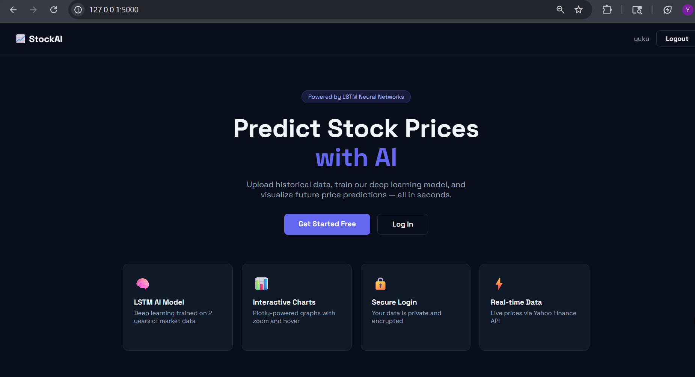
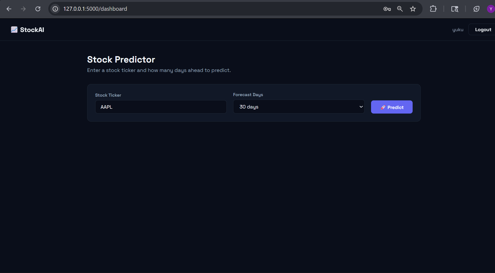
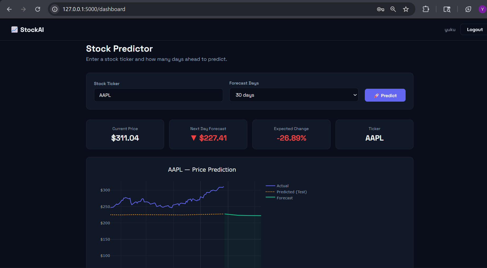
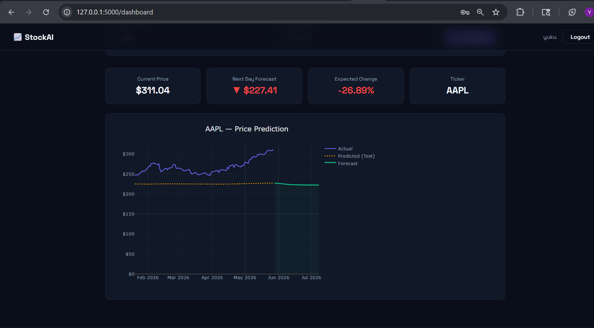

# 📈 AI Stock Market Prediction Platform

An AI-powered stock market analysis and forecasting platform built using LSTM Neural Networks, Flask, and real-time financial data. The application provides intelligent stock predictions, interactive visualizations, secure authentication, and support for 50,000+ global stock tickers.

---

## 🚀 Live Demo

### 🌐 Render Deployment
https://ai-stock-market-prediction-5j4w.onrender.com


---

## ✨ Features

- 🧠 Deep Learning stock prediction using LSTM Neural Networks
- 📊 Interactive stock charts powered by Plotly.js
- ⚡ Real-time stock data integration using Yahoo Finance API
- 🔒 Secure user authentication system
- 🌍 Support for 50,000+ stocks worldwide
- 📈 Historical trend analysis and future forecasting
- 📱 Fully responsive dark-themed user interface
- ☁️ Deployment-ready architecture

---

## 🛠️ Tech Stack

| Layer | Technology |
|---|---|
| Frontend | HTML, CSS, JavaScript, Plotly.js |
| Backend | Python, Flask |
| AI Model | PyTorch LSTM Neural Network |
| Data Source | Yahoo Finance API (yfinance) |
| Database | SQLite, SQLAlchemy |
| Authentication | Flask-Login, Werkzeug |
| Deployment | Render, Google Cloud Platform |

---

## 📂 Project Structure

```text
AI-Stock-Market-Prediction/
│
├── app.py                  # Flask application & routes
├── model.py                # LSTM model implementation
├── requirements.txt        # Project dependencies
├── render.yaml             # Render deployment configuration
├── app.yaml                # Google Cloud deployment configuration
│
├── templates/
│   ├── base.html
│   ├── index.html
│   ├── login.html
│   ├── register.html
│   └── dashboard.html
│
├── static/
│   ├── css/
│   │   └── style.css
│   │
│   └── js/
│       └── chart.js
│
└── screenshots/
```

---

## 📸 Screenshots

### 🏠 Home Page


---

### 📊 Dashboard


---

### 📈 Prediction Graph


---

### 🔮 Future Forecast

---

## 🧠 How the LSTM Model Works

### 1️⃣ Data Collection
Downloads historical OHLCV stock data using Yahoo Finance API.

### 2️⃣ Data Preprocessing
- Removes missing values
- Normalizes stock prices using MinMaxScaler
- Creates sequential time-series windows

### 3️⃣ Model Training
- 2-layer LSTM Neural Network
- Dropout regularization
- Optimized using PyTorch

### 4️⃣ Prediction
Generates:
- Actual vs Predicted stock trends
- Future stock forecasts

### 5️⃣ Visualization
Interactive charts display:
- Historical prices
- Predictions
- Forecast trends

---

## 🏗️ System Architecture

```text
Frontend (HTML/CSS/JS)
            ↓
Flask Backend API
            ↓
LSTM Prediction Engine
            ↓
Stock Data Processing Pipeline
            ↓
Yahoo Finance API
```

---

## ⚙️ Local Setup

### 1️⃣ Clone Repository

```bash
git clone https://github.com/yukthagangadhari5/AI-Stock-Market-Prediction.git
```

---

### 2️⃣ Navigate to Project Directory

```bash
cd AI-Stock-Market-Prediction
```

---

### 3️⃣ Create Virtual Environment

#### Windows

```bash
python -m venv venv
venv\Scripts\activate
```

#### Mac/Linux

```bash
python3 -m venv venv
source venv/bin/activate
```

---

### 4️⃣ Install Dependencies

```bash
pip install -r requirements.txt
```

---

### 5️⃣ Create Environment Variables

Create a `.env` file:

```env
SECRET_KEY=your-secret-key-here
```

---

### 6️⃣ Run the Application

```bash
python app.py
```

Open in browser:

```text
http://127.0.0.1:5000
```

---

## 🌍 Supported Markets & Tickers

| Market | Example Tickers |
|---|---|
| 🇺🇸 US Stocks | AAPL, TSLA, NVDA, GOOGL |
| 🇮🇳 NSE | RELIANCE.NS, INFY.NS |
| 🇮🇳 BSE | HDFCBANK.BO |
| 🪙 Crypto | BTC-USD, ETH-USD |
| 🥇 Commodities | GC=F (Gold), CL=F (Oil) |
| 📊 Indices | ^NSEI, ^GSPC |

---

## ☁️ Deployment

### 🚀 Render Deployment

1. Push code to GitHub
2. Create a new Web Service on Render
3. Connect GitHub repository
4. Add environment variables
5. Deploy application

---

### ☁️ Google Cloud Deployment

```bash
gcloud init
gcloud app create
gcloud app deploy
```

---

## 📊 Future Improvements

- 🤖 AI chatbot for stock insights
- 📈 Real-time trading signals
- 📰 News sentiment analysis
- 📊 Portfolio management dashboard
- 🔔 Smart stock alerts
- 🌐 Multi-user cloud deployment

---

## 👩‍💻 Author

### Yuktha Gangadhari

- GitHub: https://github.com/yukthagangadhari5

---

## 📄 License

This project is licensed under the MIT License.

---

## ⭐ Support

If you found this project useful, consider giving it a star ⭐ on GitHub.
